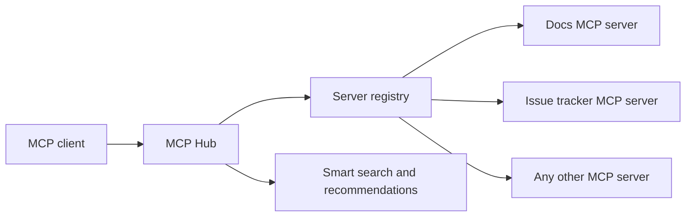

# MCP Hub

[](https://github.com/ftaricano/mcp-hub/actions/workflows/test.yml)
[](LICENSE)
[](https://nodejs.org)
[](https://modelcontextprotocol.io)
[](https://www.typescriptlang.org)

MCP Hub is a TypeScript gateway for Model Context Protocol servers. It lets you register multiple downstream MCP servers and expose one hub surface for tool discovery, routing, smart search, and recommendations.

Status: experimental. The project is suitable for local development and portfolio review, but the public API should be treated as pre-1.0.

## What It Does

- Aggregates tool metadata across registered MCP servers.
- Routes tool calls to the selected downstream server.
- Provides hub-native tools for catalog browsing, delegated calls, natural-language search, and recommendations.
- Supports stdio and HTTP/SSE downstream server entries.
- Keeps downstream credentials outside the repository through environment variables or per-server env files.
- Includes unit, integration, e2e, performance, and registry hardening tests.

MCP Hub does not bundle third-party MCP servers. All server examples are placeholders that you replace with your own commands, URLs, and credential storage.

## Requirements

- Node.js 18 or newer
- npm 10 or newer
- One or more MCP servers that you can run locally or reach over HTTP/SSE

## Install

```bash
git clone https://github.com/ftaricano/mcp-hub.git
cd mcp-hub
npm ci
npm run build
```

When an npm package is published, the intended package name is `@ftaricano/mcp-hub`.

## Quickstart

Create a local hub config:

```bash
cp hub-config.example.json hub-config.json
```

Edit `hub-config.json` so each server entry points to a real MCP server in your environment. Keep `hub-config.json` local; it is ignored by Git because it may contain paths or environment references that are specific to your machine.

Minimal stdio server example:

```json
{
  "servers": [
    {
      "id": "docs-server",
      "name": "Documentation MCP Server",
      "command": "node",
      "args": ["/absolute/path/to/docs-mcp/dist/index.js"],
      "envFile": "/absolute/path/to/docs-mcp/.env",
      "inheritEnv": ["DOCS_REGION"],
      "protocol": "stdio",
      "enabled": true,
      "timeout": 30000,
      "retries": 2,
      "toolCallRetries": {
        "enabled": true,
        "maxAttempts": 2,
        "retryableTools": ["search_docs"]
      },
      "tags": ["docs", "knowledge"]
    }
  ],
  "cache": {
    "enabled": true,
    "ttl": 300000
  },
  "security": {
    "rate_limit": 100,
    "validate_schemas": true
  },
  "logging": {
    "level": "info",
    "format": "json"
  }
}
```

Run the hub:

```bash
HUB_CONFIG="$PWD/hub-config.json" npm start
```

## MCP Client Config

Register the built hub in any MCP client that supports stdio servers:

```json
{
  "mcpServers": {
    "hub": {
      "command": "node",
      "args": ["/absolute/path/to/mcp-hub/dist/index.js"],
      "env": {
        "HUB_CONFIG": "/absolute/path/to/mcp-hub/hub-config.json"
      }
    }
  }
}
```

See [LMStudio-MCP-Config.md](LMStudio-MCP-Config.md) for an LM Studio example.

## Hub Tools

MCP Hub exposes four hub-native tools:

- `list-all-tools`: returns the aggregated downstream tool catalog.
- `call-tool`: calls a named tool on a named downstream server.
- `smart-search`: ranks available tools for a natural-language query.
- `get-recommendations`: returns recommendation-oriented results based on available tool metadata.

## Configuration

`HUB_CONFIG` can point to any JSON file matching the hub config shape. If it is not set, the hub tries common local paths for `hub-config.json`.

Server entries can use:

- `command` and `args` for stdio MCP servers,
- `url` and `protocol: "http"` for HTTP/SSE entries,
- `env` for non-secret static values,
- `envFile` for per-server secrets or local credentials,
- `inheritEnv` for explicit parent environment pass-through,
- `toolCallRetries` for known-idempotent tools only.

Downstream stdio servers inherit only a small runtime-safe environment baseline by default. Add any required parent variables explicitly with `inheritEnv`.

## Architecture



Key modules:

- `src/index.ts`: MCP server entry point and hub-native tool handlers.
- `src/registry/`: downstream server lifecycle, connections, and tool discovery.
- `src/intelligence/`: search and recommendation scoring.
- `src/cache/`: result and metadata caching.
- `src/utils/redaction.ts`: argument summarization without logging raw sensitive values.

## Development

```bash
npm run type-check
npm run lint
npm run format:check
npm test
npm run build
```

Useful focused suites:

```bash
npm run test:unit
npm run test:integration
npm run test:e2e
npm run test:performance
```

## Packaging

Validate the npm package contents before publishing:

```bash
npm pack --dry-run --json
```

The package is intentionally restricted with the `files` field in `package.json`; local configs, logs, tests, coverage, `testing-interface/`, and generated artifacts should not ship in the npm tarball.

## Security

Do not commit secrets or local operational state. In particular, keep these files and directories out of Git:

- `.env`, `.env.*` except `.env.example`
- `hub-config.json` and machine-specific config variants
- `tokens/`, `auth-state/`, `config/auth-state/`
- `credentials.json`, `token.json`, private keys, certificates, logs, and JSONL traces

Report vulnerabilities privately through [GitHub Security Advisories](https://github.com/ftaricano/mcp-hub/security/advisories/new). See [SECURITY.md](SECURITY.md) for the full policy.

## Troubleshooting

If the hub starts but downstream tools do not appear:

- confirm `HUB_CONFIG` points to the intended file,
- verify each downstream server `command`, `args`, `url`, and `protocol`,
- run the downstream MCP server directly before registering it behind the hub,
- check whether the server requires variables in `envFile` or `inheritEnv`,
- keep mutating tool calls out of retry lists unless they are explicitly idempotent.

If build or tests fail after dependency changes:

- run `npm ci` from a clean checkout,
- run `npm run type-check` before debugging runtime behavior,
- remove stale `dist/` output with `npm run clean && npm run build`.

## Contributing

Issues and focused pull requests are welcome. Before opening a PR, run:

```bash
npm run type-check
npm run lint
npm run format:check
npm test
npm run build
```

Please avoid committing local credentials, generated logs, screenshots, or machine-specific hub configs.

## License

MIT. See [LICENSE](LICENSE).
